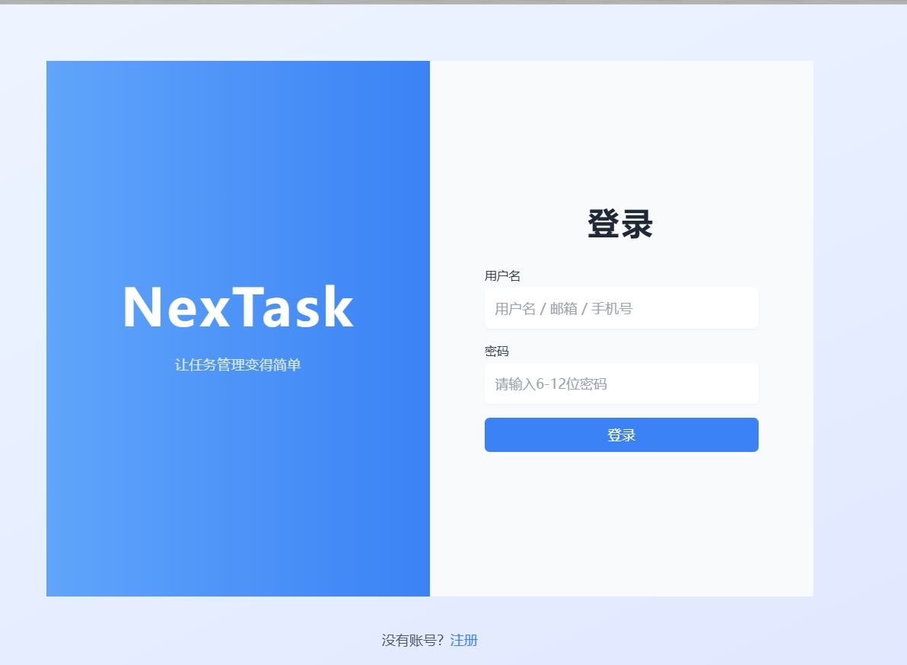
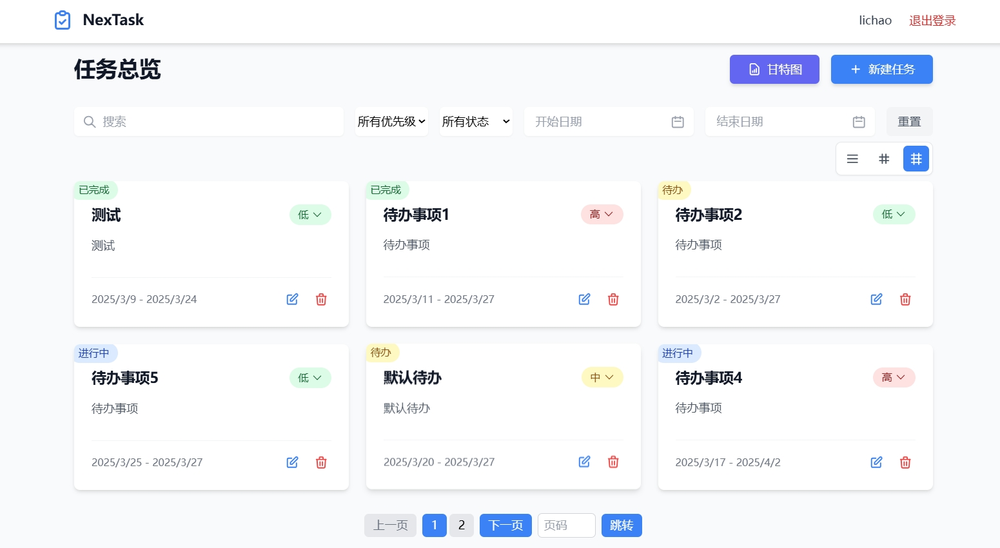
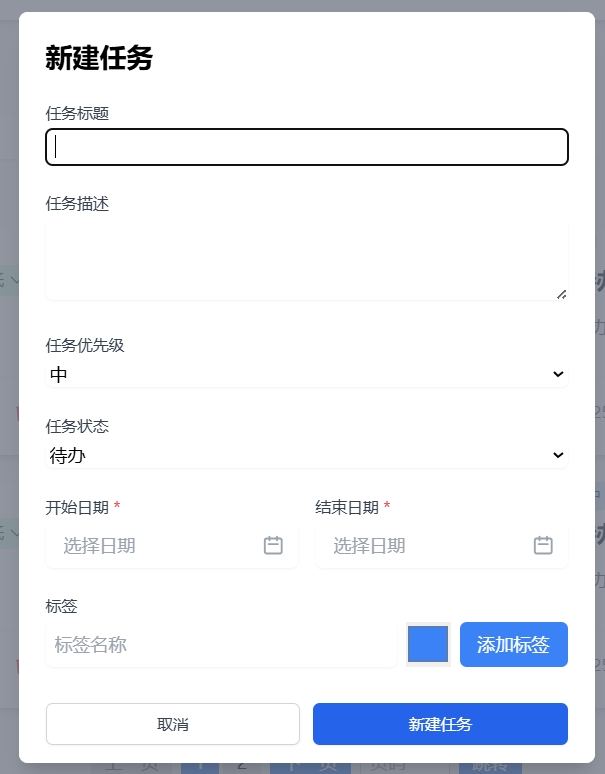

# 任务管理系统
- 前端项目：https://github.com/lichaoProgress/NexUI
- 后端项目：https://github.com/lichaoProgress/NexTask


## 登陆


## 首页


## 任务新建页面


## API文档
地址：http://127.0.0.1:8099/docs#/


## 单元测试地址
tests/test_tasks.py


## 前端项目本地运行
```bash
pnpm install

pnpm run dev
```

## 后端项目本地运行
**依赖安装**
```
pip install -r requirements.txt
```

**配置修改**
修改 `src/settings` 目录下的配置文件，如MySQL，启动IP端口等。

**本地运行**
```
python main.py
```


## 项目简介
> 任务管理系统 是一个基于 FastAPI 构建的 Web 应用程序，提供用户管理、项目管理等核心功能。


## 项目特色
**1、异步框架服务**

基于 `FastAPI` 和 `Uvicorn` 构建高性能异步服务。

**2、日志链路追踪**

实现完整的日志链路追踪，通过 `FastAPI` 中间件、`contextvars` 与日志过滤器，精确定位请求路径，提升系统可观测性与问题排查效率。

**3、统一错误处理与鉴权** 

封装统一的错误处理机制，支持 `JWT` 鉴权体系，结合 `APIRoute` 实现日志中间件，确保 Web 请求的安全性与一致性。

**4、标准化响应格式**

结合 `pydantic` 模型与错误码设计，统一定义接口响应的成功与失败返回格式，提升 API 的可读性与一致性。

**5、前端技术栈**

前端基于 `React + TypeScript + Vite` 构建。


## 项目工程结构

```python
    |-- NexTask
    |-- conf:  项目部署中间件的配置
    |-- docs:  项目文档
    |-- logs:  项目日志
    |-- py_tools:  封装工具类
    |-- src:   源代码
         |-- data_models:  数据模型
             |-- api_models:       接口出入参校验模型
             |-- logic_models:     业务数据模型
         |-- constants:    常量模块
         |-- enums:        枚举模块
         |-- dao:          数据访问层，例如mysql
         |-- controllers:  控制层，调用services 
             |-- project:  任务路由处理
             |-- user:     用户路由处理
         |-- middlewares:  中间件层
         |-- routers:      路由层，调用handlers
         |-- services:     逻辑层，业务服务逻辑
             |-- oauth:     鉴权模块 
             |-- user:      用户模块 
             |-- project:   任务模块
         |-- settings:      项目配置模块
         |-- utils:        常用工具
         |-- server.py:    服务入口
    |-- tests: 单元测试用例
    |-- .pre-commit-config.yaml: 代码格式规范
    |-- Dockerfile:          项目 Dockerfile 配置
    |-- requirements.txt     依赖文件
    |-- README.md            项目说明文档
    |-- main.py              项目主入口模块
```